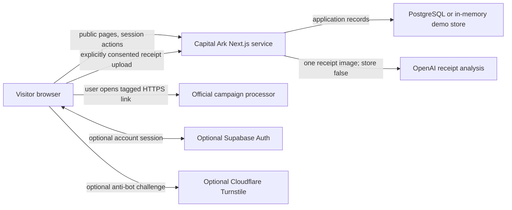

# Privacy architecture

This document describes the behavior of the source code in this repository as
of the current `main` branch. It is an engineering description, not a privacy
policy, legal opinion, deployment audit, or promise made on behalf of a fork.
The user-facing policy is at [capitalark.com/privacy](https://capitalark.com/privacy).

## Design objective

Capital Ark coordinates supporters without becoming a payment intermediary or
a customer-intelligence product. The design aims to collect the minimum data
needed to:

1. generate a safe, tagged link to an official political-contribution
   processor;
2. distinguish unresolved intent from receipt-backed progress;
3. prevent one receipt from moving more than one pledge; and
4. investigate obvious abuse without storing raw network addresses.

The repository contains no payment-processing SDK, advertising SDK, behavioral
analytics SDK, data-broker export, or field for a card number, bank account,
payment token, or platform balance. Dependencies and configuration can change,
so reviewers should verify `package.json`, the lockfile, the schema, and the
deployed environment rather than relying on this sentence indefinitely.

## Trust boundaries

The campaign processor is reached by the browser, not proxied by Capital Ark.
Payment information entered there never passes through this application's
route handlers or database.

## Data-flow inventory

### 1. Public browsing

Coalition and target pages are public and server-rendered. A reader does not
need an account or named identity. Normal network requests still pass through
the deployment's DNS, CDN, hosting, and application layers; those providers may
handle standard access metadata under their own configurations and policies.

Public progress contains aggregate cents, donor count, goal, percentage,
pending intent, and deadline information. Public recent activity contains an
amount, candidate/target, evidence tier, and timestamp. The public view model
does not include the stored `actorLabel` or a donor identity. In a small group,
even an anonymous amount and time can still be identifying; integrations must
not make that data more granular by default.

### 2. Opaque visitor session

On the first action that needs ownership, local-auth mode creates a random UUID
and stores a signed value in an HTTP-only, `SameSite=Lax`, secure-in-production
cookie with a one-year maximum age. The application persists an anonymous user
row keyed by that UUID. Reading a page alone does not mint the identity.

Supabase mode instead validates the provider session with `getUser()` and can
support an optional account claim. An email address is collected only when a
visitor asks to claim an account. The data model can hold profile and campaign-
finance prefill fields, but the current first-party contribution UI does not
request them.

### 3. Contribution intent and outbound link

The application stores:

- visitor ID and target ID;
- intended amount, tracking tag, timestamp, and pledge state;
- a salted, truncated SHA-256 hash of the client network address when a trusted
  proxy supplies one and a production salt is configured; and
- a minimized outbound attribution event containing only the target,
  processor, tracking tag, optional intended amount, and timestamp.

The raw network address, browser user agent, request referrer, and generated
processor URL are not written to the application database. The attribution
event has no visitor-ID or pledge-ID column. Its tracking tag can still be a
pseudonymous per-visitor value when a drive does not use flat tags and can be
correlated with a pledge holding the same tag. The recipient committee needs
that value for reconciliation. Hosting or edge logs are a separate
operator-controlled boundary.

Processor URLs are normalized to supported HTTPS hosts. Known one-click charge
parameters and organizer-supplied personal-prefill parameters are stripped at
ingest. The internal link-generation route has an opt-in prefill capability,
disabled by default; enabling it can place an account email or first name in
the one-time URL returned to the visitor's browser. Capital Ark does not save
that URL, so prefill values do not enter link-event storage.

### 4. Receipt check

A contribution cannot move public progress without receipt evidence. The
current path is:

1. The visitor selects one PNG, JPEG, or WebP image no larger than 8 MB and
   explicitly consents to AI analysis.
2. The server checks ownership of the pending pledge, request size, container
   signature, supported processor context, and per-user/per-network-hash rate
   limits.
3. The receipt bytes are held in request memory and sent to the OpenAI Responses
   API with `store: false`, strict structured output, and a keyed pseudonymous
   safety identifier. The prompt tells the model not to return donor identity,
   address, contact, card, or transaction-reference fields.
4. The model extracts visible document type, recipient/committee, processor,
   amount, date, completion status, and readability. It does not receive the
   expected candidate or amount.
5. Server code independently checks the extracted recipient, processor, exact
   amount, plausible date, and completed status.
6. A complete match creates an AES-256-GCM evidence token bound to the visitor,
   pledge, target, candidate, amount, evidence digest, and expiry. The data
   store repeats the critical checks before changing public progress.

Capital Ark does not write the raw screenshot, filename, model response text,
donor identity, or transaction identifier to application storage on this path.
It releases its in-process byte reference when the request finishes; that is
not a claim of hardware-level secure erasure.

The application persists only:

- model identifier and check time;
- extracted amount and contribution date;
- candidate, committee, amount, processor, and date match flags;
- controlled reason codes; and
- a secret-keyed HMAC-SHA-256 image digest used to prevent reuse.

The digest is deliberately keyed so two independent deployments cannot compare
receipt fingerprints without sharing a secret. New records leave the legacy
`receiptUrl` field null.

`store: false` disables OpenAI Responses application-state storage. It does not
necessarily disable provider abuse-monitoring logs; OpenAI may retain submitted
content for up to the period described by its current API data-control policy
unless the operator's organization has an applicable retention control such as
Zero Data Retention. Operators must verify the current provider terms and their
own organization settings.

An AI-checked match is consistency evidence, not bank settlement, committee
reconciliation, or proof that a contribution was legally accepted.

### 5. Drive creation

The organizer supplies coalition copy, candidate/committee details, office,
jurisdiction, goals, suggested amounts, deadlines, and official processor URLs.
The application attaches an opaque organizer ID. Public submissions are labeled
community-created; accepting a supported processor hostname does not promote a
drive to platform-verified status.

### 6. Public totals and activity

Only `COMPLETED` pledges with receipt-backed evidence move `raisedCents` or the
donor count. Pending amounts are separate. Historical receipt-free records can
remain in storage for audit compatibility but are excluded from public totals
and recent activity.

The public activity adapter deliberately omits contributor labels. Adding a
first name and last initial would require separate, explicit, revocable opt-in;
it must never be inferred from receipt content.

## Retention visible in this repository

| Record | Current behavior |
| --- | --- |
| Raw AI-path receipt image | Not persisted by Capital Ark; held for the request only. |
| Receipt-derived metadata and keyed digest | Retained with the confirmed pledge; no automated deletion schedule is implemented. |
| Pending pledge | Expired by the scheduled job after 72 hours; the row remains as an expired audit record. |
| Salted network-address hash on a pledge | Cleared by the same scheduled job after 30 days. Live rate limits use the current request hash and do not depend on this retained field. |
| Declined/expired/historical pledge | Retained in the database unless an operator applies a separate retention process. |
| Outbound attribution event | Retained without a visitor ID, pledge ID, URL, referrer, user agent, or network hash. It contains only target, processor, tracking tag, optional amount, and timestamp. |
| Activity event | Retained; public reads filter the evidence tier and omit actor identity. |
| Local visitor cookie | Browser maximum age of one year; deleting it can break access to unfinished history. |
| Optional account email | Retained by the application/auth provider until an account-deletion process is implemented or an operator removes it. |

The lack of a comprehensive deletion workflow is a current limitation, not a
feature. Before enterprise integrations, the project should publish purpose-
based retention periods and implement user/account deletion and event expiry.

## Security and privacy controls

- signed local cookies or provider-validated Supabase sessions;
- ownership checks at every pledge/receipt transition;
- Zod validation and bounded upload parsing;
- MIME plus file-signature validation for receipt images;
- encrypted, short-lived, context-bound receipt evidence tokens;
- keyed receipt deduplication and defense-in-depth store validation;
- TLS certificate verification for configured managed PostgreSQL CAs;
- CSP, HSTS, frame denial, content-type sniffing protection, referrer policy,
  and restrictive browser permissions;
- supported-host allowlists and stripping of automatic-charge URL parameters;
- rate limits for drive creation, link generation, pledge creation,
  confirmation, and receipt review;
- scheduled removal of pledge network hashes after 30 days; and
- no-cache responses for sensitive receipt flows.

The current rate limiter is in process. It is suitable only for the documented
single-service-instance deployment. A horizontally scaled or public API
deployment needs a shared, durable limiter.

## Threats considered

| Threat | Current mitigation | Residual risk |
| --- | --- | --- |
| Organizer supplies a malicious or one-click-charge URL | Supported HTTPS host normalization; unsafe and prefill parameters stripped | An allowlisted processor page can later change; human/source review is still needed. |
| Visitor claims another pledge | Session ownership checks and a context-bound evidence token | A stolen authenticated session can act as that visitor. |
| One receipt inflates several targets | Keyed digest uniqueness plus pledge/target/candidate/amount binding | Similar but not byte-identical images require model/server evaluation. |
| Model invents or misreads a field | Expected values withheld from extraction; deterministic exact-match gates; fail closed | A sophisticated forgery can look internally consistent; no processor reconciliation exists. |
| Small-group activity reveals identity | Public actor labels omitted | Amount, target, and time can still re-identify someone with outside knowledge. |
| Logs leak political metadata | Application avoids logging receipt content and stores a hashed network address | Infrastructure, database, error-monitoring, or future integration settings can reintroduce logs. |
| Multi-instance abuse bypass | Per-user and per-hash in-process limits | Limits are not shared across instances and reset on restart. |

## What source publication does not prove

A public repository does not establish that the hosted service:

- runs the public commit without modification;
- uses the documented environment variables or retention settings;
- has no infrastructure-level analytics, backups, logs, or administrator
  access;
- has completed legal, penetration, accessibility, or campaign-finance review;
  or
- maintains the same subprocessors over time.

Useful future trust work includes publishing the deployed commit identifier,
signed releases and build provenance, a software bill of materials, a current
subprocessor list, retention/deletion controls, independent security review,
and deployment configuration evidence that does not expose secrets.

## Audit map

| Question | Primary source |
| --- | --- |
| What can the database hold? | [`prisma/schema.prisma`](../prisma/schema.prisma) |
| What moves public totals? | [`src/lib/data/progress.ts`](../src/lib/data/progress.ts) and store implementations |
| What leaves for a processor? | [`src/lib/tracking/link-builder.ts`](../src/lib/tracking/link-builder.ts) |
| What happens to a receipt? | [`src/app/api/receipts/verify/route.ts`](../src/app/api/receipts/verify/route.ts) and [`src/lib/receipts/receipt-review.ts`](../src/lib/receipts/receipt-review.ts) |
| How is evidence bound and deduplicated? | [`src/lib/receipts/receipt-evidence-token.ts`](../src/lib/receipts/receipt-evidence-token.ts) and [`src/lib/receipts/accepted-evidence.ts`](../src/lib/receipts/accepted-evidence.ts) |
| How is identity established? | [`src/lib/auth/session.ts`](../src/lib/auth/session.ts) |
| What is public activity allowed to expose? | [`src/lib/domain/types.ts`](../src/lib/domain/types.ts) and store activity adapters |
| Which third-party photo terms apply? | [`src/lib/data/campaigns/nc-hemp-photo-sources.ts`](../src/lib/data/campaigns/nc-hemp-photo-sources.ts) |
